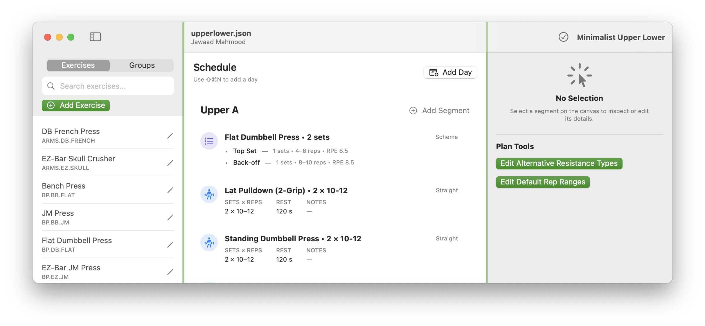
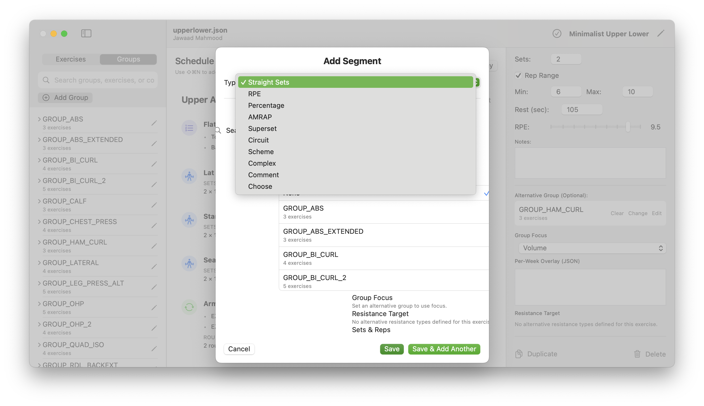
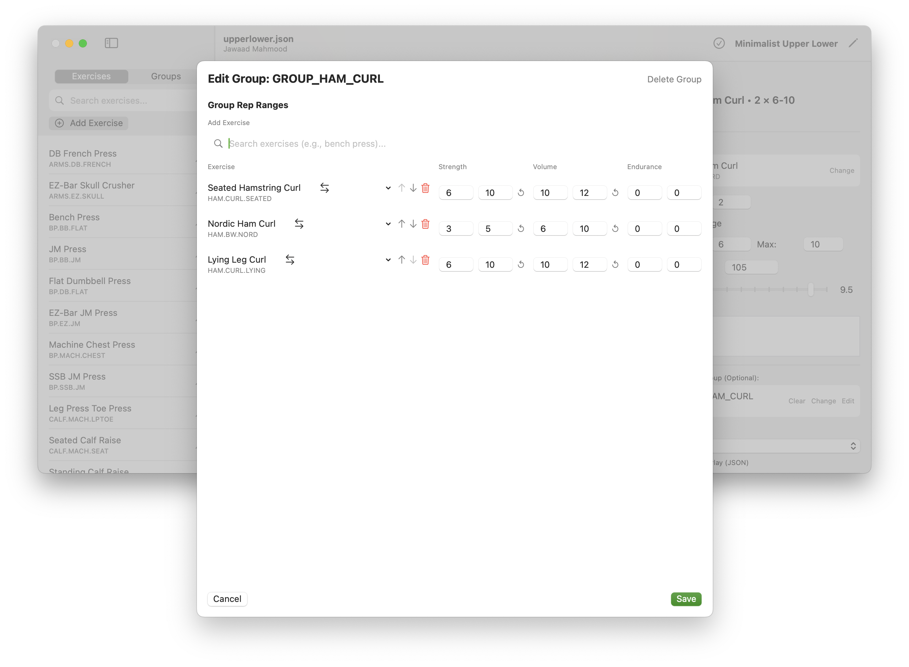

# RED ✪ STAR Plan Studio

*“A desktop PLAN editor, validator, and exporter for Red Star Weightlifting.*

---

## Screenshots

### iOS
<p>
  
  
  
  
  <details>
  <summary><b>More Screenshots</b></summary>
  

  </details>
</p>

<details>
<summary><b>Linux</b></summary>
<br>
<p>(Coming soon)</p>
</details>

---

**Plan Studio** is a native desktop editor for authoring and validating weight training plans used by **RED ✪ STAR Weightlifting**. It is designed for offline-first plan creation, deterministic exports, and long-term durability of strength programming data.

The application targets self-coached lifters who want precise control over programming without relying on cloud services or mobile devices during training.

---

## Installation

### macOS

Download the zipped app file from [here](https://github.com/jmahmood/WEIGHTTRAINING-EDITOR/releases/download/v1.1.1-mac/WeightliftingEditor.zip).  Unzip and drag to your Application Folder

### Linux

Please see build description below.

---

## What This Application Does

- Author structured weight training plans using the Red Star PLAN JSON format (v0.3 and v0.4).
- Validate plans against both schema and semantic rules before use.
- Export plans in a device-ready layout for handheld or watch-based execution.

The editor is intentionally **offline-first**. Network access is optional and only used for explicit file synchronization.

---

## How It Fits Into RED ✪ STAR Weightlifting

Plans authored here are executed elsewhere.

Typical workflow:

1. **Author** a plan on desktop (this project).
2. **Export** the plan to a handheld or watch device.
3. **Execute** the plan in the gym without a phone or internet.
4. **Sync back** completed session logs if you would like to analyze.

Supported execution targets:

- **RED ✪ STAR Weightlifting (watchOS + iOS bridge)**  
  Apple Watch–based execution. Supports a subset of PLAN v0.3 and v0.4.

- **Basic Weightlifting (ROCKNIX / Anbernic devices)**  
  Legacy handheld executor targeting PLAN v0.3. Device support is limited to the RG35XX Plus and related devices running ROCKNIX.

The desktop editor is the **authoritative source of truth** for plans across all targets.

---

## Platform Support

- **macOS**: Feature-complete reference implementation (PLAN v0.4).
- **Linux**: GTK4/libadwaita editor (PLAN v0.3; v0.4 parity planned).

All core logic (validation, export, metrics) is shared across platforms and implemented in Rust.

---

## Key Components

### Desktop Editors
- **GTK4 / libadwaita editor (Linux)**  
  Wide-screen layout with navigator, canvas, inspector, autosave drafts, and validation gating.

- **SwiftUI editor (macOS)**  
  Native universal app (Apple Silicon + Intel) using Rust via FFI for all business logic.

### CLI Companion (`comp`)
A command-line tool for plan lifecycle management:
- Validate, save, retrieve, and export plans.
- Generate chart specifications (Vega-Lite).
- Inspect errors and conflicts deterministically.

### Metrics Indexer
Processes session CSV logs and produces cached metrics:
- Estimated 1RM
- Volume
- PR series

These metrics feed both CLI charts and editor visualizations.


---

## The PLAN Format

In contrast to generic fitness logs or spreadsheets, the **RED ✪ STAR PLAN** format is semantically aware of strength training logic. It models complex progression rules and validates them before they ever reach the gym floor.  Any app that uses the open PLAN format document has both native editors and can implement the following.

### 1. Advanced Programming Logic

* **Anchored Prescriptions:** Define back-off sets as a percentage of a top set performed earlier in the session (e.g., *“5 sets at 80% of today’s Top Single”*).
* **Week-Dependent Overlays (Wave Loading):** Alter volume, intensity, or rep ranges per week without rewriting the segment (e.g., implementing 5/3/1 or tapering cycles).
* **Smart Substitutions:** Define substitution groups with "Roles." A substitute exercise can automatically adjust its rep range depending on whether it is being used for a "Heavy" or "Volume" slot.

### 2. Complex Structures

* **First-Class Intensifiers:** Native support for **Drop sets** (with drop %), **Cluster sets** (with intra-set rest), **Myo-reps**, and **Rest-Pause**.
* **Barbell Complexes:** Model single-bar flows where multiple movements (Clean → Front Squat → Jerk) share a single load and set index.
* **Supersets & Contrast:** Supports standard pairings and **Contrast/PAP** (Post-Activation Potentiation) logic where strength work pairs with plyometrics.

### 3. Precision Constraints

* **Velocity Based Training (VBT):** Embed velocity targets (`target_mps`) and fatigue cut-offs (`loss_cap_pct`) directly into the plan.
* **Structured Tempo:** Explicitly define eccentric, bottom, concentric, and top phases in seconds.
* **Non-Weight Load Axes:** Validate inputs for non-plate loaded equipment, such as specific band colors or machine pin settings.

### 4. Strict Validation

The editor uses a Rust-based engine to prevent logical errors before export:

* Enforces **Reps XOR Time** (a set cannot be both a rep target and a time hold).
* Validates that **Anchors** reference valid, preceding set indices.
* Ensures **RPE vs. RIR** logic is consistent (RPE takes precedence if both are present).

---

## Repository Layout (High-Level)

- `apps/editor-gtk/` – Linux desktop editor
- `apps/editor-macos/` – macOS SwiftUI editor
- `crates/core/` – Shared plan models, export logic, charts, paths
- `crates/validate/` – Schema + semantic validation
- `crates/cli/` – CLI companion (`comp`)
- `crates/indexer/` – Metrics ingestion and caching
- `scripts/` – File-based sync utilities

---

## Storage Model

The application uses platform-standard directories and creates them on demand.

- **Plans**: versioned, append-only
- **Drafts**: autosaved working copies
- **Metrics**: cached, reproducible outputs

---

## Build & Run (Summary)

### Linux
```bash
cargo run --release -p weightlifting-editor-gtk
cargo run --bin weightlifting-editor
````

### macOS

```bash
cd apps/editor-macos
./create-app-bundle.sh
```

Unsigned builds are sufficient for local use. Code signing is optional and documented below.

---

## Status

Active development. macOS is the reference platform for now, but we intend for Linux parity in the near future.

Any breaking PLAN changes are gated behind explicit version bumps and migration notes.

---

## License

See repository license files.

---

## Current Status

Feature,macOS (SwiftUI),Linux (GTK4),CLI (comp)
PLAN Version,v0.4 (Full),v0.3 (v0.4 Pending),v0.4
Primary Use,Authoring,Authoring,Automation/CI
Status,Reference,Active Dev,Stable

---

## Signing binary for Apple devices

**Code Signing & Notarization (Optional):**
By default, the app bundle is created without code signing. To distribute the app to other Macs, you'll need to sign and notarize it.

```bash
# Option 1: Set environment variables directly
export CODESIGN_IDENTITY="Developer ID Application: Your Name (TEAMID)"
export NOTARY_KEYCHAIN_PROFILE="YourProfileName"
cd apps/editor-macos && ./create-app-bundle.sh

# Option 2: Use the example config file (recommended)
cd apps/editor-macos
cp .env.signing.example .env.signing
# Edit .env.signing with your credentials
source .env.signing && ./create-app-bundle.sh
```

To set up notarization credentials:
```bash
# Store your Apple ID credentials in keychain (one-time setup)
xcrun notarytool store-credentials "YourProfileName" \
  --apple-id "your-apple-id@example.com" \
  --team-id "TEAMID" \
  --password "app-specific-password"
```

For local development and testing, signing is not required.


